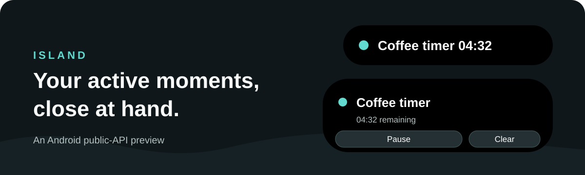

<div align="center">



<sub>Preview illustration. Window placement and appearance vary by Android device.</sub>

# Island for Android

**Timers and permitted media sessions, close at hand.**

[Get started](#get-started) · [What you can do](#what-you-can-do) · [Current scope](#current-scope)

</div>

Keep active tasks in a small, expandable window near the top of your Android screen.

> **Preview build:** This app is in active development and currently builds from source. Its window uses Android's display-over-other-apps permission; Android keeps control of the status bar, notification shade, privacy indicators and lock screen.

## What you can do

| Feature | In the app |
| --- | --- |
| Timers | Start several independent countdowns with a preset or a custom name and duration. Pause, resume or clear each one in the app or its notification. Running timers retain their deadlines if the app process closes. |
| Island window | Pick an activity, then show a compact pill. Tap it to expand or collapse; expanded timers have Pause, Resume and Clear controls. An allowed media session can show its advertised Previous, Play or Pause, and Next controls. Long press to stop the window. Up to three sources appear at once, with more retained in the queue. |
| Media | Opt in to media-session discovery, then choose which observed apps may appear. Playback buttons appear only when the active session advertises those actions. |
| Device status | View battery, ringer and torch state. Opt in to a charging or flashlight activity while that signal is active; the app observes these states and does not control them. |

## Get started

1. Install the [debug APK](#build-from-source) on an Android 11 or newer device and open **Island Prototype**.
2. Start a timer. To show its pill over other apps, open **Overlay settings**, allow display over other apps for Island Prototype, return to the app and choose **Enable Island**.
3. For timer notifications, choose **Enable timer alerts** and grant notification permission. **Allow exact timing** is optional; without it, Android may deliver completion later.
4. To show media, choose **Enable media**, grant Android notification access in Settings, then allow each observed media app in the dashboard. You can disable media access or stop the Island window from the app at any time.
5. To show charging or flashlight status in the pill, turn on either activity in **Device signals**. These are off by default and disappear when the corresponding signal ends.

Timer completion notifications are silent. The app does not play an alarm sound. If notifications are blocked when a timer finishes, its completion remains visible in the app but no old alert is sent after access returns. Android can delay inexact alarms, and a force-stop prevents alarm delivery until the app is reopened. The Island window closes when the screen turns off or the device locks; Android may also remove an app-owned overlay when its process stops. While media access is enabled, Android blocks ordinary screenshots and screen capture of this app's dashboard; the media pill is protected separately. Ordinary notifications are not automatically turned into activities.

## Current scope

This build is an Android public-API preview. Its layout and ordering are provisional. It has been exercised on a Samsung SM-S906E running Android 16, but has **not** been visually matched to an iPhone 18 Pro Max on iOS 27 or qualified on the provisional Pixel 11 Pro XL/Android 17 target. It does not replace Android's native status chip or draw on the lock screen and always-on display.

---

## For developers and agents

### Build from source

Requirements: JDK 17, Android SDK 36, Gradle 9.7.1 and Android Gradle Plugin 9.1.1. From the repository root:

```sh
export JAVA_HOME="$(brew --prefix openjdk@17)"
export ANDROID_HOME="$HOME/Library/Android/sdk"
./gradlew --no-daemon --max-workers=1 :app:assembleDebug :app:lintDebug
```

The APK is `app/build/outputs/apk/debug/app-debug.apk`. Install it with `adb install app/build/outputs/apk/debug/app-debug.apk`. Its application ID is `dev.luinbytes.dynamicisland`, minimum API 30, target API 36. Pull requests assemble and lint on GitHub Actions. No release-signed package is published.

### Implementation and evidence

- [Reference specification](REFERENCE_SPEC.md), [implementation sequence](docs/verification/09-implementation-acceptance.md), [Android architecture gate](docs/android/05-android-architecture.md)
- [Samsung prototype evidence](docs/verification/13-samsung-prototype-evidence.md), [Samsung Clock admission probe](docs/verification/14-samsung-clock-admission.md), [device qualification](docs/android/18-device-qualification.md), [paired comparison protocol](docs/verification/12-comparison-protocol.md)
- [Agent workspace](agents/README.md) for agent-specific handoffs and working notes

The APK keeps source identity and presentation separate. App-owned timers use monotonic deadlines, per-timer AlarmManager broadcasts and opt-in notifications. Media is keyed by the exact active session token; actions are rechecked before dispatch. Direct charging and torch sources are opt-in and sit behind active tasks in the versioned Android ordering policy. A listener callback alone never admits a third-party notification as an activity. Source behavior and UI parity remain subject to the linked physical-device and reference gates.
